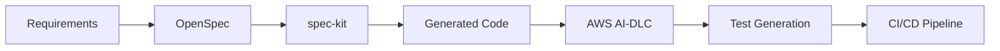

# Spec-Driven Development

## From Simple Prompts to Specification-Driven Development

---

# Today's Journey

1. **Simple Prompt**
2. **Prompt Engineering**
3. **Context Engineering**
4. **Plan Mode**
5. **Specification-Driven Development**
6. **Tools**

---

# Task: User Profile Component

**Requirements:**

- Display user information (name, email, avatar)
- Edit mode with form validation
- Save/cancel functionality
- Loading states
- Error handling

---

# 1. Simple Prompt

## Prompt:

```text
Create a user profile component
```

## Benefits:

- ✅ Quick to write
- ✅ No preparation needed

## Negatives:

- ❌ Ambiguous - What should it display?
- ❌ Missing context - Which Angular version? Styling?
- ❌ No validation rules - Email format? Required fields?
- ❌ No error handling - What happens when API fails?
- ❌ Inconsistent results - Different AI responses each time

---

# 2. Prompt Engineering

## Prompt:

```markdown
## Context
- Angular 17 with standalone components
- Using Angular Material for UI
- NgRx for state management
- Project follows clean architecture

## Task
Create a user profile component with:
- Display mode: Show user info (name, email, avatar URL)
- Edit mode: Form with validation (email required, name min 2 chars)
- Actions: Save, Cancel, Edit buttons
- States: Loading, Error, Success

## Requirements
- Use reactive forms
- Implement proper TypeScript types
- Add accessibility attributes
- Include unit tests
- Follow Angular style guide
```

## Benefits over Simple Prompt:

- ✅ Specific - Clear technology stack
- ✅ Structured - Organized sections
- ✅ Complete - Covers all aspects
- ✅ Testable - Includes validation rules

## Negatives vs Context Engineering:

- ❌ AI doesn't know your project structure
- ❌ No existing code patterns
- ❌ No documentation context
- ❌ Manual context creation required

---

# 3. Context Engineering

## Prompt:

```markdown
Create user profile component following existing patterns with reactive forms, proper TypeScript types, accessibility attributes, unit tests, and Angular style guide compliance.

## Project Structure
src/
├── app/
│   ├── components/
│   │   ├── user-profile/
│   │   └── shared/
│   ├── services/
│   │   └── user.service.ts
│   ├── models/
│   │   └── user.model.ts
│   └── store/
│       └── user/

## Existing Code
// user.model.ts
export interface User {
  id: string;
  name: string;
  email: string;
  avatarUrl?: string;
  updatedAt: Date;
}

// user.service.ts pattern
@Injectable({ providedIn: 'root' })
export class UserService {
  updateUser(id: string, data: Partial<User>): Observable<User> {
    return this.http.patch<User>(`/api/users/${id}`, data);
  }
}
```

## Benefits over Prompt Engineering:

- ✅ Consistent with existing patterns
- ✅ Reusable components and services
- ✅ Type-safe with existing models
- ✅ Testable following project conventions

## Negatives vs Plan Mode:

- ❌ No structured planning
- ❌ Limited architecture vision
- ❌ No dependency analysis
- ❌ Single-session focus
- ❌ No iterative refinement
- ❌ Manual context crafting

---

# 4. Plan Mode

## Prompt:

```markdown
## Project Structure & Context
[Same as Context Engineering - include all project info]

## Planning Steps

### Step 1: Component Architecture
UserProfileComponent
├── UserProfileDisplayComponent (view mode)
├── UserProfileEditComponent (edit mode)
└── UserProfileActionsComponent (buttons)

### Step 2: Data Flow
UserService -> UserProfileStore -> Component
                    ↓
              Form Validation
                    ↓
              API Update -> Store Update

### Step 3: State Management
interface UserProfileState {
  user: User | null;
  isLoading: boolean;
  error: string | null;
  isEditing: boolean;
}

### Step 4: Testing Strategy
- Unit tests for each component
- Integration tests for user flow
- E2E tests for complete scenarios

## Task
Implement user profile component following this architecture plan.
```

## Benefits over Context Engineering:

- ✅ Clear architecture before coding
- ✅ Identify dependencies early
- ✅ Better estimation of effort
- ✅ Reduced rework during implementation

## Negatives vs SDD:

- ❌ Session-based planning
- ❌ Hard to share and refine
- ❌ No persistent workspace
- ❌ Lost after conversation ends
- ❌ Difficult to track changes over time

---

# Plan Mode vs SDD

## Plan Mode Limitations:

- ❌ Session-based planning
- ❌ Hard to share and refine
- ❌ No persistent workspace
- ❌ Lost after conversation ends
- ❌ Difficult to track changes over time

## SDD Advantages:

- ✅ Persistent specifications through entire development lifecycle
- ✅ Shareable workspace for team collaboration
- ✅ Version-controlled specs that evolve with the feature
- ✅ Continuous improvement as requirements change
- ✅ Cross-session continuity - pick up where you left off

---

# 5. Spec-Driven Development

## Prompt:

```markdown
# User Profile Component Specification

## Component: UserProfileComponent

### Purpose
Display and edit user profile information with proper validation and state management.

### Interface
interface UserProfileComponent {
  user: User | null;
  isLoading: boolean;
  error: string | null;
  isEditing: boolean;
  
  editUser(): void;
  saveUser(formData: UserProfileForm): void;
  cancelEdit(): void;
}

### Behavior Requirements

1. **Display Mode**
   - Shows user.name, user.email, user.avatarUrl
   - Edit button visible
   - Loading spinner during data fetch
   - Error message display

2. **Edit Mode**
   - Form with name (required, min 2 chars)
   - Form with email (required, valid email)
   - Avatar URL (optional, valid URL)
   - Save and Cancel buttons
   - Validation messages

3. **State Transitions**
   - Display → Edit: Click edit button
   - Edit → Display: Save successful or Cancel
   - Any state → Loading: During API calls
   - Any state → Error: API failures

### Test Cases
- Should display user information correctly
- Should validate form inputs
- Should handle API errors gracefully
- Should maintain state during transitions

## Task
Implement this specification exactly as written.
```

## Benefits over Plan Mode:

- ✅ Clear, testable specifications
- ✅ Standardized behavior
- ✅ Comprehensive coverage
- ✅ Living documentation

## Negatives vs Tools:

- ❌ Manual specification writing
- ❌ No template generation
- ❌ No AI assistance
- ❌ No automation

---

# 6. Tools for SDD

## spec-kit

```bash
npm install -g spec-kit
spec-kit init
spec-kit generate component user-profile
```

## Benefits over Manual SDD:

- ✅ Template-based spec generation
- ✅ Integration with testing frameworks
- ✅ Documentation automation

## Negatives vs openspec:

- ❌ Proprietary format
- ❌ Limited language support
- ❌ No standardization

---

# openspec

## Configuration:

```yaml
# openspec.yaml
version: "1.0"
components:
  user-profile:
    type: "angular-component"
    specs:
      - "user-profile.spec.md"
      - "user-profile.test.ts"
```

## Benefits over spec-kit:

- ✅ Standardized specification format
- ✅ Multi-language support
- ✅ CI/CD integration

## Negatives vs AI-DLC:

- ❌ Manual specification writing
- ❌ No AI generation
- ❌ Limited automation

---

# AWS AI-DLC

## Usage:

```python
from aws_ai_dlc import SpecGenerator

generator = SpecGenerator(model="claude-3")
spec = generator.generate_from_requirements(
    requirements="user-profile-requirements.md",
    framework="angular",
    output_format="openspec"
)
```

## Benefits over openspec:

- ✅ AI-powered specification generation
- ✅ Natural language to specs
- ✅ Automated test case generation

## Complete Workflow:



---

# Complete SDD Workflow

## Process:

1. **Requirements Gathering** - Business needs → User stories
2. **Specification Writing** - OpenSpec format → Detailed behavior
3. **AI-Assisted Generation** - AWS AI-DLC → Code scaffolding
4. **Implementation** - spec-kit → Component generation
5. **Testing** - Automated tests from specs
6. **Documentation** - Living docs with code

## Final Result:

```typescript
// Generated from specification
@Component({
  selector: 'app-user-profile',
  template: `
    <ng-container *ngIf="!isEditing; else editMode">
      <app-user-profile-display
        [user]="user"
        [isLoading]="isLoading"
        [error]="error"
        (edit)="editUser()">
      </app-user-profile-display>
    </ng-container>
    
    <ng-template #editMode>
      <app-user-profile-edit
        [user]="user"
        (save)="saveUser($event)"
        (cancel)="cancelEdit()">
      </app-user-profile-edit>
    </ng-template>
  `
})
export class UserProfileComponent implements OnInit {
  // Implementation follows specification exactly
}
```

---

# Key Takeaways

## From Simple Prompt to SDD:

🚀 **Start Simple** - Learn prompt engineering basics
🎯 **Add Context** - Give AI your project knowledge
📋 **Plan First** - Architecture before implementation
📝 **Specify Everything** - Clear, testable requirements
🛠️ **Use Tools** - spec-kit, openspec, AI-DLC

## Benefits Achieved:

✅ **Consistent code** across team members
✅ **Better quality** with comprehensive testing
✅ **Faster development** with automation
✅ **Living documentation** that stays current
✅ **Easier maintenance** with clear specifications

---

# Thank You!

## Questions?
