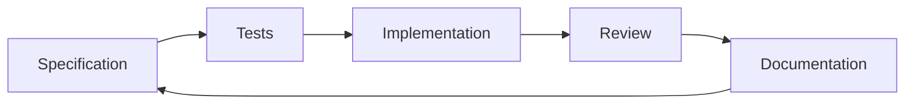

# Spec-Driven Development

## Building Software with Specifications First

---

# What is Spec-Driven Development?

A development methodology where:

- **Specifications drive the development process**
- **Tests are written before implementation**
- **Documentation and code stay in sync**

---

# Key Principles

## 1. **Specification First**

- Write detailed specs before coding
- Define behavior, not just implementation
- Include edge cases and error handling

## 2. **Test-Driven**

- Tests validate specifications
- Automated testing ensures compliance
- Regression protection

## 3. **Documentation as Code**

- Specs live with the code
- Version controlled and reviewed
- Always up-to-date

---

# Benefits

### ✅ **Clarity**

- Clear requirements before development
- Reduced ambiguity
- Better communication

### ✅ **Quality**

- Higher test coverage
- Fewer bugs
- Better edge case handling

### ✅ **Maintainability**

- Self-documenting code
- Easier onboarding
- Better long-term sustainability

---

# Workflow



1. **Write Specification**
2. **Create Tests**
3. **Implement Code**
4. **Review & Refactor**
5. **Update Documentation**

---

# Tools & Practices

## Specification Formats

- **Markdown** - Human-readable
- **OpenAPI** - API specs
- **JSON Schema** - Data validation
- **Gherkin** - Behavior scenarios

## Testing Frameworks

- **Jest** - JavaScript
- **pytest** - Python
- **RSpec** - Ruby
- **JUnit** - Java

---

# Getting Started

## Step 1: Define Your Spec

```markdown
# User Authentication API

## POST /auth/login
 authenticates user with email/password
 returns JWT token on success
 returns 401 on invalid credentials
```

## Step 2: Write Tests

```javascript
test('should return JWT for valid credentials', async () => {
  const response = await request(app)
    .post('/auth/login')
    .send({ email: 'user@example.com', password: 'password' });
  
  expect(response.status).toBe(200);
  expect(response.body.token).toBeDefined();
});
```

---

# Best Practices

## ✅ **Do**

- Keep specs simple and clear
- Include examples
- Test edge cases
- Review specifications regularly

## ❌ **Don't**

- Over-specify implementation details
- Ignore error cases
- Write specs after code
- Skip documentation updates

---

# Conclusion

Spec-Driven Development helps teams:

- **Build better software**
- **Reduce technical debt**
- **Improve collaboration**
- **Maintain quality over time**

---

# Thank You!

## Questions?

---
<!-- _class: invert -->
# Resources

- [GitHub Repository](https://github.com/your-repo)
- [Documentation](https://docs.example.com)
- [Community](https://community.example.com)

## Contact

- Email: <team@example.com>
- Slack: #spec-driven-dev
